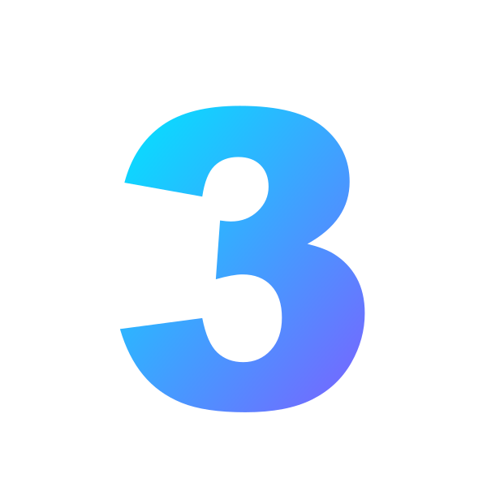

# Darkfin Design System

Complete visual reference for the darkfin-slides aesthetic. Read this when writing or restyling slides.

## Palette

### Background layers (use PNG, not CSS gradients)

| Asset | Use on | Description |
|-------|--------|-------------|
| `title-bg.png` | Cover, section dividers, closing | Clean twin radial glow (purple top-left + cyan bottom-right) on near-black. NO grid. Premium feel. |
| `title-bg-grid.png` | Alt cover for "data-heavy" decks | Same hero radial + subtle grid overlay. Use when content is tech/blockchain-leaning. |
| `content-bg.png` | Most content slides | Subtle dark gradient with grid + small cyan corner glow |
| `accent-bg.png` | Solution / launch / questions | Twin radial glows (purple bottom-left, cyan top-right) |
| `card-cyan.png` / `card-purple.png` / `card-gold.png` | Optional rich card backdrops | Solid-feel gradient panels (rarely needed; default `#151A2E` is enough) |

Apply only on `<body>`:
```css
body {
  background-image: url('../assets/content-bg.png');
  background-size: cover;
}
```

`html2pptx` rejects backgrounds on inner `<div>`.

### Surface colors

Slate palette (Tailwind-aligned). Single canonical palette — all templates use these tokens.

| Token | Hex | Purpose |
|-------|-----|---------|
| `bg-deep` | `#0B0E1A` | Page base under PNG |
| `panel` | `#151A2E` | Card/panel fill |
| `panel-alt` | `#1F2437` | Sub-panel (table headers, secondary fills) |
| `panel-inset` | `#10182A` | Nested rows |
| `border` | `#2A3043` | 1pt panel border |

### Accent colors

Cyan `#00E5FF` is fixed primary. Tailwind-scale secondaries.

| Token | Hex | Use |
|-------|-----|-----|
| `cyan` (primary) | `#00E5FF` | Eyebrow tags, accent words, `<span>` highlights, dot indicators, left-borders |
| `cyan-deep` | `#0E3F4F` | Filled badge/pill on dark |
| `purple` (violet-500) | `#8B5CF6` | Secondary accent, manager/multi-team highlights |
| `purple-deep` | `#2E1B5C` | Filled purple panel/bar |
| `purple-light` | `#C4B5FD` | Text on purple panel |
| `green` (emerald-500) | `#10B981` | Launch / safety / "ok" callouts |
| `green-deep` | `#0A3F2E` | Filled success panel |
| `red` (red-500) | `#EF4444` | Error/forbidden states (sparingly) |
| `amber` (amber-500) | `#F59E0B` | Warnings, manager flag, decision questions |
| `amber-deep` | `#3F2E0A` | Filled amber panel |

### Text colors

| Token | Hex | Use |
|-------|-----|-----|
| `text` (slate-50) | `#F8FAFC` | Headlines, body |
| `text-2` (slate-300) | `#CBD5E1` | Strong body / list items |
| `muted` (slate-400) | `#94A3B8` | Sub-text, captions, descriptions |
| `label` (slate-500) | `#64748B` | Tiny labels above values |
| `mono-on-dark` | `#0B0E1A` | Text on neon-cyan filled badges (inverse) |

## Typography

| Element | Font | Size | Weight | Color | Notes |
|---------|------|------|--------|-------|-------|
| Slide num (top bar) | Courier New | 13–14pt | bold | `#00E5FF` | Format: `NN /` |
| Top bar label | Arial | 11pt | bold | `#94A3B8` | UPPERCASE, letter-spacing 3pt |
| Eyebrow tag | Arial | 9–10pt | bold | accent color | UPPERCASE, letter-spacing 3pt |
| h1 (slide title) | Arial | 20–30pt (typical 22–26) | bold | `#F8FAFC` | One accent word wrapped in `<span>` |
| h3 (card title) | Arial | 11–14pt | bold | `#F8FAFC` |  |
| Body | Arial | 10–11pt | normal | `#94A3B8` | line-height 1.4–1.5 |
| Numeric ID / mono detail | Courier New | 9–10pt | bold | accent color | Use for amounts, codes, IDs |
| Table header | Arial | 9–10pt | bold | `#94A3B8` | letter-spacing 1pt |
| Table cell | Arial | 9–10pt | normal | `#F8FAFC` |  |

Web-safe only: Arial, Courier New. NO `'Segoe UI'`, `'Inter'`, etc.

## Spacing

| Context | Value |
|---------|-------|
| Slide body padding (top/bottom) | 16–26pt (adjust to fit) |
| Slide body padding (left/right) | 50pt |
| Top bar padding | 14–16pt top/bottom, 50pt sides |
| Card padding | 10–18pt (inner cards smaller) |
| Inter-card gap | 8–16pt |
| Bar accent under h1 | 4pt × 50pt wide, 14–22pt bottom margin |
| Eyebrow → h1 | 4–6pt |
| h1 → lead/sub | 6–12pt |
| Lead → first block | 14–22pt |

## Visual signature

Every content slide opens with the **status bar pattern**:

```html
<div class="bar">
  <p class="num">04 /</p>
  <p class="title">QUY TẮC 1 — SẢN PHẨM</p>
</div>
```

- Two-token format: mono slide number + UPPERCASE label
- Border-bottom: 1pt `#2A3043`
- Cyan number for default slides, gold for "decisions/questions" slide, purple-bg `#2E1B5C` for the final section divider

Below the bar: eyebrow tag → h1 with one accent-colored `<span>` → optional accent bar (4pt × 50pt) → body content.

## Component motifs

### Numbered step badge
```html
<div class="badge">
  <p>1</p>
</div>
```
- 20–24pt square, neon cyan fill (`#00E5FF`)
- Text inside: Courier New, 10–11pt, bold, `#0B0E1A`

### Avatar circle (user/persona)
- 30–38pt square, accent fill (`#00E5FF` cyan default, `#8B5CF6` purple for multi-team, `#F59E0B` gold for manager)
- Single letter, Arial bold, dark text

### Chip / tag
```html
<div class="chip"><p>SEO Pro</p></div>
```
- Background `#10182A`, 1pt border `#2A3043`, padding `3pt 8pt`
- Variants:
  - `.chip.group` → border `#3D2D6E`, text `#C4B5FD` (purple) = "group assignment"
  - `.chip.single` → border `#00E5FF`, text `#00E5FF` (cyan) = "single product"
  - `.no` (struck-through) → text `#64748B`, `text-decoration: line-through` = "hidden"

### Timeline dot
- 14pt circle, accent-colored
- Cyan default, gold for warning step, green for success step

### Callout box (success / warning)
```html
<div class="foot ok">  <!-- or .warn -->
  <p class="ico">✓</p>
  <div class="text">
    <h3>Zero risk</h3>
    <p>...</p>
  </div>
</div>
```
- Success: bg `#0A3F2E`, 1pt border `#10B981`
- Warning: bg `#3F2E0A`, 1pt border `#F59E0B`

## Icons

Pre-rasterized cyan PNG icons live in `assets/icons/`. Reference them in HTML as plain ``:

```html

```

Default sizing: **24pt × 24pt** for inline icons next to text, **40pt × 40pt** for header/feature icons, **60pt × 60pt** for hero icons.

**Bundled icon set (39 icons):**

| Category | Names |
|----------|-------|
| Identity | `user`, `user-add`, `team`, `admin`, `manager` |
| Communication | `email`, `phone`, `mobile`, `globe` |
| Security | `lock`, `shield`, `fingerprint`, `bot` |
| Commerce | `ticket`, `qr`, `chart`, `money`, `cart` |
| State | `success`, `warning`, `error`, `info`, `star` |
| Flow | `arrow`, `arrow-down`, `clock`, `hourglass`, `calendar` |
| System | `database`, `cloud`, `cog`, `tasks`, `rocket` |
| Social | `twitter`, `facebook`, `tiktok`, `linkedin` |
| Hardware | `camera`, `wifi` |

To add or recolor icons:

```bash
# Regenerate the full set with custom color
node <skill-dir>/scripts/gen-icons.js --color "#10B981" --out ./assets/icons --size 256

# Or edit ICONS array in gen-icons.js to add new react-icons FA names, then regenerate.
```

## Gradient step numbers

Pre-rasterized oversized step number PNGs in `assets/numbers/` (1-12). Cyan-to-purple linear gradient. Use them as the visual anchor on step/process slides instead of solid circle badges.

```html

```

Default sizing: **80-120pt** square for hero step number, **40-50pt** for inline. Larger = more dramatic.

Regenerate with custom palette:

```bash
node <skill-dir>/scripts/gen-numbers.js --primary "#00E5FF" --secondary "#8B5CF6" --out ./assets/numbers
```

## Anti-patterns

- Do NOT use light backgrounds.
- Do NOT mix more than 3 accent colors per slide.
- Do NOT use shadows on text (only on `<div>` shapes, and keep opacity ≤ 1.0).
- Do NOT write multi-line tech jargon for sales audience — break into bullet chips or examples.
- Do NOT use emojis except minimal `✓ ✗ ★` glyphs when needed.
