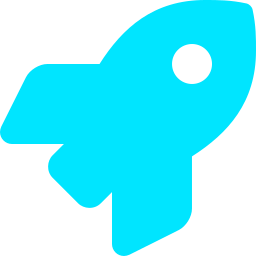
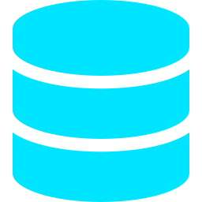
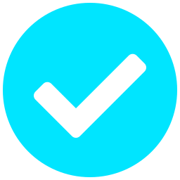

# Slide Templates

Copy-paste HTML templates for the 29 darkfin slide types. Each has been overflow-tested at 720×405pt. All hex codes use the **slate palette** (Tailwind-aligned). Replace placeholder content; keep structure + class names + sizing.

## Table of contents

1. [Title slide](#1-title-slide)
2. [Problem cards (3-column)](#2-problem-cards-3-column)
3. [Solution: core idea + features + spotlight](#3-solution-core-idea--features--spotlight)
4. [How-it-works: 3-layer map](#4-how-it-works-3-layer-map)
5. [Rule + example (left explain / right concrete)](#5-rule--example-left-explain--right-concrete)
6. [Scenario table (who-sees-what)](#6-scenario-table-who-sees-what)
7. [Admin mockup (4 steps + UI panel)](#7-admin-mockup-4-steps--ui-panel)
8. [Timeline / launch phases](#8-timeline--launch-phases)
9. [Decision questions grid](#9-decision-questions-grid)
10. [Safety / timeline-then-outcomes](#10-safety--timeline-then-outcomes)
11. [Section divider (full-bleed)](#11-section-divider-full-bleed)
12. [Agenda / TOC](#12-agenda--toc)
13. [KPI metric grid (big numbers)](#13-kpi-metric-grid-big-numbers)
14. [Before / After comparison](#14-before--after-comparison)
15. [Process flow (horizontal arrows)](#15-process-flow-horizontal-arrows)
16. [Quote / testimonial](#16-quote--testimonial)
17. [Closing / Q&A / Thanks](#17-closing--qa--thanks)
18. [Roadmap (horizontal Gantt)](#18-roadmap-horizontal-gantt)
19. [Pricing tiers (3 plan cards)](#19-pricing-tiers-3-plan-cards)
20. [Architecture / system map](#20-architecture--system-map)
21. [Risk × Impact 2×2 matrix](#21-risk--impact-22-matrix)
22. [Feature comparison table](#22-feature-comparison-table)
23. [Step slide (giant gradient number + UI mock)](#23-step-slide-giant-gradient-number--ui-mock)
24. [Admin dashboard (KPI bar + filter + bulk action)](#24-admin-dashboard-kpi-bar--filter--bulk-action)
25. [Scoring tiers (color-coded threshold blocks)](#25-scoring-tiers-color-coded-threshold-blocks)
26. [Horizontal milestone timeline](#26-horizontal-milestone-timeline)
27. [Vertical timeline (rail + cards)](#27-vertical-timeline)
28. [Date-prefix vertical timeline](#28-date-prefix-vertical-timeline)
29. [Alternating vertical timeline (zigzag)](#29-alternating-vertical-timeline-zigzag)

---

## 1. Title slide

Uses `assets/title-bg.png`. Hero typography, accent chips, three-column meta row.

```html
<!DOCTYPE html>
<html><head><style>
html { background: #0B0E1A; }
body {
  width: 720pt; height: 405pt; margin: 0; padding: 0;
  font-family: Arial, sans-serif; display: flex; flex-direction: column;
  background-image: url('../assets/title-bg.png'); background-size: cover;
}
.frame { flex: 1; padding: 36pt 60pt; box-sizing: border-box; display: flex; flex-direction: column; justify-content: center; }
.eyebrow { display: flex; align-items: center; gap: 12pt; margin: 0 0 18pt 0; }
.dot { width: 8pt; height: 8pt; background: #00E5FF; border-radius: 50%; }
.eyebrow p { color: #00E5FF; font-size: 11pt; letter-spacing: 4pt; font-weight: bold; margin: 0; }
h1 { color: #F8FAFC; font-size: 38pt; margin: 0 0 12pt 0; line-height: 1.1; font-weight: bold; }
h1 span { color: #00E5FF; }
.sub { color: #94A3B8; font-size: 15pt; margin: 0 0 22pt 0; line-height: 1.4; max-width: 580pt; }
.tag-row { display: flex; gap: 10pt; margin: 0 0 22pt 0; }
.chip { background: #151A2E; border: 1pt solid #2A3043; padding: 5pt 12pt; }
.chip p { color: #00E5FF; font-size: 9pt; letter-spacing: 2pt; font-weight: bold; margin: 0; }
.chip.purple { border-color: #3D2D6E; }
.chip.purple p { color: #C4B5FD; }
.chip.gold { border-color: #3F2E0A; }
.chip.gold p { color: #F59E0B; }
.meta-row { display: flex; gap: 24pt; padding-top: 18pt; border-top: 1pt solid #2A3043; }
.meta-col p { margin: 0; }
.meta-col .label { color: #64748B; font-size: 9pt; letter-spacing: 2pt; font-weight: bold; margin-bottom: 4pt; }
.meta-col .val { color: #F8FAFC; font-size: 12pt; font-weight: bold; }
</style></head><body>
<div class="frame">
  <div class="eyebrow">
    <div class="dot"></div>
    <p>BRAND · CONTEXT</p>
  </div>
  <h1>Slide title here<br><span>accent words</span></h1>
  <p class="sub">One-sentence value prop or context line.</p>
  <div class="tag-row">
    <div class="chip"><p>TAG ONE</p></div>
    <div class="chip purple"><p>TAG TWO</p></div>
    <div class="chip gold"><p>TAG THREE</p></div>
  </div>
  <div class="meta-row">
    <div class="meta-col"><p class="label">AUDIENCE</p><p class="val">Sales / Manager</p></div>
    <div class="meta-col"><p class="label">VERSION</p><p class="val">v1.0</p></div>
    <div class="meta-col"><p class="label">DATE</p><p class="val">DD.MM.YYYY</p></div>
  </div>
</div>
</body></html>
```

## 2. Problem cards (3-column)

```html
<body>
<div class="bar">
  <p class="num">01 /</p>
  <p class="title">SECTION LABEL</p>
</div>
<div class="body">
  <p class="eyebrow">EYEBROW</p>
  <h1>Headline with <span>accent word</span></h1>
  <p class="lead">Optional context sentence.</p>
  <div class="cards">
    <div class="card">
      <p class="icon">01</p>
      <h3>Point title</h3>
      <p>One-sentence description.</p>
    </div>
    <!-- repeat 3x -->
  </div>
</div>
</body>
```

Key CSS:
```css
.bar { padding: 16pt 50pt; border-bottom: 1pt solid #2A3043; display: flex; align-items: center; gap: 12pt; }
.bar .num { color: #00E5FF; font-size: 14pt; font-family: 'Courier New', monospace; font-weight: bold; margin: 0; }
.bar .title { color: #94A3B8; font-size: 11pt; letter-spacing: 3pt; font-weight: bold; margin: 0; }
.body { flex: 1; padding: 26pt 50pt; box-sizing: border-box; }
.eyebrow { color: #F59E0B; font-size: 10pt; letter-spacing: 3pt; font-weight: bold; margin: 0 0 6pt 0; }
h1 { color: #F8FAFC; font-size: 28pt; margin: 0 0 6pt 0; line-height: 1.2; }
h1 span { color: #F59E0B; }
.lead { color: #94A3B8; font-size: 12pt; margin: 0 0 22pt 0; }
.cards { display: flex; gap: 14pt; }
.card { flex: 1; background: #151A2E; border: 1pt solid #2A3043; border-top: 3pt solid #F59E0B; padding: 18pt; }
.card .icon { color: #F59E0B; font-size: 26pt; font-weight: bold; font-family: 'Courier New', monospace; margin: 0 0 8pt 0; line-height: 1; }
.card h3 { color: #F8FAFC; font-size: 13pt; margin: 0 0 6pt 0; }
.card p { color: #94A3B8; font-size: 11pt; margin: 0; line-height: 1.5; }
```

Swap `#F59E0B` → `#00E5FF` (cyan) for "neutral feature" version or `#10B981` (green) for "positive outcome".

## 3. Solution: core idea + features + spotlight

Two-column. Left = 3 feature rows with badge + text. Right = highlighted spotlight panel.

```html
<div class="row">
  <div class="left">
    <div class="feat">
      <div class="badge"><p>1</p></div>
      <div class="text"><h3>Feature title</h3><p>One sentence.</p></div>
    </div>
    <!-- repeat 3x -->
  </div>
  <div class="right">
    <div class="spotlight">
      <p class="label">CORE</p>
      <h2>Big idea<br>= <span>punchline</span></h2>
      <p>Supporting sentence.</p>
    </div>
  </div>
</div>
```

```css
.row { display: flex; gap: 16pt; }
.left { flex: 1.1; } .right { flex: 1; }
.feat { background: #151A2E; border: 1pt solid #2A3043; padding: 10pt 14pt; margin-bottom: 6pt; display: flex; gap: 11pt; align-items: flex-start; }
.feat .badge { background: #0E3F4F; border: 1pt solid #00E5FF; width: 22pt; height: 22pt; display: flex; align-items: center; justify-content: center; flex-shrink: 0; }
.feat .badge p { color: #00E5FF; font-family: 'Courier New', monospace; font-size: 10pt; font-weight: bold; margin: 0; }
.feat .text h3 { color: #F8FAFC; font-size: 11pt; margin: 0 0 2pt 0; }
.feat .text p { color: #94A3B8; font-size: 10pt; margin: 0; line-height: 1.4; }
.spotlight { background: #151A2E; border: 1pt solid #3D2D6E; height: 100%; padding: 18pt; display: flex; flex-direction: column; justify-content: center; }
.spotlight .label { color: #C4B5FD; font-size: 9pt; letter-spacing: 3pt; font-weight: bold; margin: 0 0 8pt 0; }
.spotlight h2 { color: #F8FAFC; font-size: 22pt; margin: 0 0 6pt 0; line-height: 1.15; }
.spotlight h2 span { color: #C4B5FD; }
.spotlight p { color: #94A3B8; font-size: 10pt; margin: 0; line-height: 1.45; }
```

## 4. How-it-works: 3-layer map

Three vertical columns. Each has a colored pill label + name + bulleted list. Optional foot callout.

```html
<div class="map">
  <div class="layer">
    <div class="head">
      <div class="pill"><p>LAYER 1</p></div>
      <p class="name">Layer name</p>
    </div>
    <ul>
      <li>Point one</li>
      <li>Point two with <b>bold</b></li>
    </ul>
  </div>
  <div class="layer purple"> ... </div>
  <div class="layer gold"> ... </div>
</div>
<div class="foot">
  <p><b>Takeaway:</b> ...</p>
</div>
```

```css
.map { display: flex; gap: 14pt; align-items: stretch; }
.layer { flex: 1; background: #151A2E; border: 1pt solid #2A3043; padding: 14pt; }
.layer .head { display: flex; align-items: center; gap: 8pt; margin-bottom: 10pt; padding-bottom: 8pt; border-bottom: 1pt dashed #2A3043; }
.layer .head .pill { background: #00E5FF; padding: 2pt 8pt; }
.layer .head .pill p { color: #0B0E1A; font-size: 8pt; font-weight: bold; letter-spacing: 1pt; margin: 0; }
.layer .head .name { color: #F8FAFC; font-size: 12pt; font-weight: bold; margin: 0; }
.layer ul { margin: 0; padding-left: 14pt; }
.layer li { color: #94A3B8; font-size: 10pt; margin-bottom: 5pt; line-height: 1.35; }
.layer li b { color: #F8FAFC; }
.purple { border-color: #3D2D6E; }
.purple .head .pill { background: #8B5CF6; }
.gold { border-color: #3F2E0A; }
.gold .head .pill { background: #F59E0B; }
.foot { margin-top: 16pt; background: #0E3F4F; border-left: 3pt solid #00E5FF; padding: 10pt 14pt; }
.foot p { color: #F8FAFC; font-size: 11pt; margin: 0; line-height: 1.4; }
.foot p b { color: #00E5FF; }
```

## 5. Rule + example (left explain / right concrete)

Use for any rule slide where you want bullet points on the left and a visual example (chips, lists, dashboard) on the right.

```html
<div class="row">
  <div class="col-l">
    <div class="point">
      <h3>Sub-rule one</h3>
      <p>Description with <b>highlight</b>.</p>
    </div>
    <!-- 2–3 points -->
  </div>
  <div class="col-r">
    <p class="label">EXAMPLE — <span>concrete scenario</span></p>
    <!-- bespoke right-side content (avatars, table, chips, etc.) -->
  </div>
</div>
```

```css
.row { display: flex; gap: 16pt; flex: 1; }
.col-l { flex: 1; display: flex; flex-direction: column; gap: 8pt; }
.col-r { flex: 1.05; background: #151A2E; border: 1pt solid #2A3043; padding: 16pt 18pt; }
.point { background: #151A2E; border: 1pt solid #2A3043; border-left: 3pt solid #00E5FF; padding: 10pt 13pt; }
.point h3 { color: #F8FAFC; font-size: 12pt; margin: 0 0 3pt 0; }
.point p { color: #94A3B8; font-size: 10pt; margin: 0; line-height: 1.4; }
.point p b { color: #00E5FF; }
.col-r .label { color: #94A3B8; font-size: 10pt; letter-spacing: 2pt; font-weight: bold; margin: 0 0 12pt 0; }
.col-r .label span { color: #00E5FF; }
```

Two persona-card variant (e.g., Sales A vs Sales B): replace `.col-l`/`.col-r` with two `.col` panels, each with `.who` (avatar + name) + see-list + hide-list.

## 6. Scenario table (who-sees-what)

Dense table with a setup card on top.

```html
<div class="setup">
  <div class="col"><p class="lbl">GROUP 1</p><p class="val">Names · <b>roles</b></p></div>
  <div class="col"><p class="lbl">GROUP 2</p><p class="val">...</p></div>
  <div class="col"><p class="lbl">ADMIN</p><p class="val">...</p></div>
</div>
<div class="tbl-wrap">
  <div class="tbl-title"><p>WHO SEES WHAT?</p></div>
  <table>
    <tr><th>Person</th><th>Item 1</th><th>Item 2</th><th>Item 3</th></tr>
    <tr><td><span class="user">Anh</span> <span class="role">— team A</span></td><td><span class="ok">✓ See</span></td><td class="mute">— hidden</td><td><span class="ok">✓ See</span></td></tr>
    <!-- repeat -->
  </table>
</div>
```

```css
.setup { background: #151A2E; border: 1pt solid #2A3043; padding: 8pt 12pt; margin-bottom: 8pt; display: flex; gap: 10pt; }
.setup .col { flex: 1; }
.setup .col p { margin: 0; font-size: 9pt; line-height: 1.35; }
.setup .col .lbl { color: #00E5FF; font-size: 8pt; letter-spacing: 2pt; font-weight: bold; margin-bottom: 3pt; }
.setup .col .val { color: #F8FAFC; }
.setup .col .val b { color: #F59E0B; }
.tbl-wrap { background: #151A2E; border: 1pt solid #2A3043; flex: 1; }
.tbl-title { background: #1F2437; padding: 6pt 12pt; border-bottom: 1pt solid #2A3043; }
.tbl-title p { color: #00E5FF; font-size: 9pt; letter-spacing: 2pt; font-weight: bold; margin: 0; }
table { width: 100%; border-collapse: collapse; }
th { background: #10182A; color: #94A3B8; text-align: left; padding: 5pt 10pt; font-size: 9pt; letter-spacing: 1pt; font-weight: bold; border-bottom: 1pt solid #2A3043; }
td { padding: 5pt 10pt; font-size: 9pt; border-bottom: 1pt solid #2A3043; color: #F8FAFC; }
td .user { color: #00E5FF; font-weight: bold; font-family: 'Courier New', monospace; }
td .role { color: #94A3B8; font-size: 9pt; }
td .ok { color: #10B981; font-weight: bold; }
td .no { color: #EF4444; font-weight: bold; }
td.mute { color: #64748B; }
```

## 7. Admin mockup (4 steps + UI panel)

```html
<div class="row">
  <div class="col-l">
    <div class="action"><div class="step"><p>1</p></div><div class="text"><h4>Action title</h4><p>Description.</p></div></div>
    <!-- 4 actions -->
  </div>
  <div class="col-r">
    <div class="mock-head">
      <p>ADMIN PANEL</p>
      <p class="url">/admin/path</p>
    </div>
    <div class="mock-body">
      <div class="mock-team-name">
        <div class="swatch"></div>
        <h4>Entity name</h4>
        <div class="pill"><p>METADATA</p></div>
      </div>
      <div class="mock-section">
        <p class="label">SECTION LABEL</p>
        <div class="mock-row"><p>Item name</p><p class="right mgr">★ MANAGER</p></div>
        <div class="mock-row"><p>Item name</p><p class="right member">member</p></div>
      </div>
    </div>
  </div>
</div>
```

```css
.action { background: #151A2E; border: 1pt solid #2A3043; padding: 8pt 12pt; margin-bottom: 6pt; display: flex; gap: 10pt; align-items: center; }
.action .step { background: #00E5FF; width: 20pt; height: 20pt; display: flex; align-items: center; justify-content: center; flex-shrink: 0; }
.action .step p { color: #0B0E1A; font-size: 10pt; font-weight: bold; margin: 0; }
.action .text h4 { color: #F8FAFC; font-size: 11pt; margin: 0; }
.action .text p { color: #94A3B8; font-size: 9pt; margin: 0; line-height: 1.3; }
.col-r { background: #151A2E; border: 1pt solid #2A3043; padding: 0; }
.mock-head { background: #1F2437; padding: 10pt 14pt; border-bottom: 1pt solid #2A3043; display: flex; justify-content: space-between; align-items: center; }
.mock-head p { color: #00E5FF; font-size: 10pt; letter-spacing: 2pt; font-weight: bold; margin: 0; }
.mock-head .url { color: #64748B; font-size: 9pt; font-family: 'Courier New', monospace; font-weight: normal; }
.mock-body { padding: 12pt 14pt; }
.mock-team-name { display: flex; align-items: center; gap: 8pt; margin-bottom: 10pt; }
.mock-team-name .swatch { width: 12pt; height: 12pt; background: #00E5FF; }
.mock-team-name h4 { color: #F8FAFC; font-size: 14pt; margin: 0; }
.mock-team-name .pill { background: #10182A; padding: 2pt 8pt; border: 1pt solid #2A3043; }
.mock-team-name .pill p { color: #00E5FF; font-size: 9pt; margin: 0; font-family: 'Courier New', monospace; }
.mock-section { margin-bottom: 8pt; }
.mock-section .label { color: #94A3B8; font-size: 9pt; letter-spacing: 2pt; font-weight: bold; margin: 0 0 5pt 0; }
.mock-row { display: flex; justify-content: space-between; padding: 5pt 8pt; background: #10182A; margin-bottom: 3pt; }
.mock-row p { margin: 0; color: #F8FAFC; font-size: 10pt; }
.mock-row .right { font-family: 'Courier New', monospace; font-size: 9pt; }
.mock-row .right.mgr { color: #F59E0B; font-weight: bold; }
.mock-row .right.member { color: #94A3B8; }
```

## 8. Timeline / launch phases

Four steps with mono day labels, big mono numbers, descriptions. Bottom success callout.

```html
<div class="row">
  <div class="step">
    <p class="day">DAY 0</p>
    <p class="num">01</p>
    <h3>Step title</h3>
    <p>Description.</p>
  </div>
  <!-- 4 steps -->
</div>
<div class="foot">
  <p class="ico">✓</p>
  <div class="text"><h3>Outcome label</h3><p>Outcome sentence.</p></div>
</div>
```

```css
.row { display: flex; gap: 11pt; }
.step { flex: 1; background: #151A2E; border: 1pt solid #2A3043; padding: 12pt 13pt; }
.step .day { color: #10B981; font-size: 9pt; letter-spacing: 2pt; font-weight: bold; margin: 0 0 4pt 0; }
.step .num { color: #F8FAFC; font-size: 24pt; font-family: 'Courier New', monospace; font-weight: bold; margin: 0 0 6pt 0; line-height: 1; }
.step h3 { color: #F8FAFC; font-size: 11pt; margin: 0 0 4pt 0; }
.step p { color: #94A3B8; font-size: 9pt; margin: 0; line-height: 1.4; }
.foot { margin-top: 12pt; background: #0A3F2E; border: 1pt solid #10B981; padding: 10pt 14pt; display: flex; align-items: center; gap: 12pt; }
.foot .ico { color: #10B981; font-size: 20pt; font-weight: bold; margin: 0; }
.foot .text h3 { color: #10B981; font-size: 12pt; margin: 0 0 2pt 0; }
.foot .text p { color: #F8FAFC; font-size: 10pt; margin: 0; line-height: 1.4; }
```

## 9. Decision questions grid

For the final "what we need from you" slide. 6 cards in a 2×3 grid, gold accent. Use accent-bg.png + purple top bar.

```html
<body style="background-image: url('../assets/accent-bg.png');">
<div class="bar" style="background:#2E1B5C;">
  <p class="num" style="color:#F59E0B;">11 /</p>
  <p class="title" style="color:#FFFFFF;">DECISIONS NEEDED</p>
</div>
<div class="body">
  <p class="eyebrow">DECISIONS</p>
  <h1>6 questions to <span>lock the design</span></h1>
  <p class="sub">Answer these and dev can start.</p>
  <div class="grid">
    <div class="q">
      <p class="qnum">Q1</p>
      <h3>Question title?</h3>
      <p>Context with <b>highlight</b>.</p>
    </div>
    <!-- 6 questions -->
  </div>
</div>
</body>
```

```css
.grid { display: grid; grid-template-columns: 1fr 1fr; gap: 7pt; }
.q { background: #151A2E; border: 1pt solid #2A3043; border-left: 3pt solid #F59E0B; padding: 7pt 11pt; }
.q .qnum { color: #F59E0B; font-size: 9pt; font-family: 'Courier New', monospace; font-weight: bold; margin: 0 0 2pt 0; }
.q h3 { color: #F8FAFC; font-size: 10pt; margin: 0 0 2pt 0; line-height: 1.2; }
.q p { color: #94A3B8; font-size: 9pt; margin: 0; line-height: 1.3; }
.q p b { color: #00E5FF; }
```

## 10. Safety / timeline-then-outcomes

When showing a scenario over time + the takeaway. Top: horizontal timeline with dots. Bottom: 2–3 outcome boxes (ok/warn).

```html
<div class="timeline">
  <h3>SCENARIO TITLE</h3>
  <div class="tl-row">
    <div class="tl-step"><div class="dot"></div><p class="when">MONTH 1</p><h4>What happens</h4><p>Description.</p></div>
    <div class="tl-step warn"><div class="dot"></div><p class="when">MONTH 3</p><h4>Change</h4><p>...</p></div>
    <div class="tl-step ok"><div class="dot"></div><p class="when">MONTH 4</p><h4>Outcome</h4><p>...</p></div>
  </div>
</div>
<div class="outcome">
  <div class="box ok"><h4>✓ What's safe</h4><p>...</p></div>
  <div class="box warn"><h4>! What's restricted</h4><p>...</p></div>
</div>
```

```css
.timeline { background: #151A2E; border: 1pt solid #2A3043; padding: 16pt 18pt; margin-bottom: 12pt; }
.timeline h3 { color: #F59E0B; font-size: 11pt; margin: 0 0 12pt 0; letter-spacing: 2pt; }
.tl-row { display: flex; gap: 0; align-items: stretch; }
.tl-step { flex: 1; position: relative; padding: 0 8pt; }
.tl-step .dot { width: 14pt; height: 14pt; background: #00E5FF; border-radius: 50%; margin: 0 auto 8pt auto; }
.tl-step.warn .dot { background: #F59E0B; }
.tl-step.ok .dot { background: #10B981; }
.tl-step .when { color: #64748B; font-size: 9pt; text-align: center; margin: 0 0 4pt 0; font-family: 'Courier New', monospace; }
.tl-step h4 { color: #F8FAFC; font-size: 11pt; text-align: center; margin: 0 0 5pt 0; }
.tl-step p { color: #94A3B8; font-size: 10pt; text-align: center; margin: 0; line-height: 1.4; }
.outcome { display: flex; gap: 12pt; }
.outcome .box { flex: 1; padding: 12pt 14pt; }
.outcome .box.ok { background: #0A3F2E; border: 1pt solid #10B981; }
.outcome .box.warn { background: #3F2E0A; border: 1pt solid #F59E0B; }
.outcome .box h4 { margin: 0 0 4pt 0; font-size: 12pt; }
.outcome .box.ok h4 { color: #10B981; }
.outcome .box.warn h4 { color: #F59E0B; }
.outcome .box p { color: #F8FAFC; font-size: 11pt; margin: 0; line-height: 1.45; }
```

---

## 11. Section divider (full-bleed)

Major-section transition slide. No status bar. Big chapter number + section title + 1-line tagline.

```html
<body style="background-image: url('../assets/title-bg.png'); justify-content: center; align-items: center;">
<div class="frame">
  <p class="chapter">CHAPTER 02</p>
  <div class="rule"></div>
  <h1>The <span>Solution</span></h1>
  <p class="tag">Three rules, one outcome.</p>
</div>
</body>
```

```css
body { display: flex; }
.frame { padding: 0 80pt; max-width: 600pt; }
.chapter { color: #00E5FF; font-size: 12pt; letter-spacing: 6pt; font-weight: bold; margin: 0 0 20pt 0; font-family: 'Courier New', monospace; }
.rule { width: 80pt; height: 4pt; background: #00E5FF; margin-bottom: 24pt; }
h1 { color: #F8FAFC; font-size: 64pt; margin: 0 0 16pt 0; line-height: 1; font-weight: bold; }
h1 span { color: #00E5FF; }
.tag { color: #94A3B8; font-size: 18pt; margin: 0; line-height: 1.4; }
```

## 12. Agenda / TOC

Sectioned list with numbered dots, section name + description. Use early in the deck.

```html
<div class="body">
  <p class="eyebrow">AGENDA</p>
  <h1>Today we cover <span>five topics</span></h1>
  <div class="toc">
    <div class="item">
      <div class="num"><p>01</p></div>
      <div class="text">
        <h3>Section title</h3>
        <p>One-sentence description.</p>
      </div>
      <p class="time">~5 min</p>
    </div>
    <!-- repeat 5x -->
  </div>
</div>
```

```css
.toc { display: flex; flex-direction: column; gap: 6pt; }
.toc .item { background: #151A2E; border: 1pt solid #2A3043; padding: 10pt 16pt; display: flex; align-items: center; gap: 14pt; }
.toc .num { width: 36pt; height: 36pt; border: 1pt solid #00E5FF; display: flex; align-items: center; justify-content: center; flex-shrink: 0; }
.toc .num p { color: #00E5FF; font-family: 'Courier New', monospace; font-size: 13pt; font-weight: bold; margin: 0; }
.toc .text { flex: 1; }
.toc .text h3 { color: #F8FAFC; font-size: 13pt; margin: 0 0 2pt 0; }
.toc .text p { color: #94A3B8; font-size: 10pt; margin: 0; line-height: 1.35; }
.toc .time { color: #64748B; font-size: 10pt; font-family: 'Courier New', monospace; margin: 0; flex-shrink: 0; }
```

## 13. KPI metric grid (big numbers)

4-card grid of headline metrics. Pair big Courier number + label + delta indicator.

```html
<div class="kpis">
  <div class="kpi">
    <p class="label">METRIC NAME</p>
    <p class="value">847<span class="unit">K</span></p>
    <p class="delta up">↑ 12.4% vs last quarter</p>
  </div>
  <!-- repeat 4x -->
</div>
```

```css
.kpis { display: grid; grid-template-columns: 1fr 1fr 1fr 1fr; gap: 12pt; }
.kpi { background: #151A2E; border: 1pt solid #2A3043; padding: 18pt 16pt; border-bottom: 3pt solid #00E5FF; }
.kpi .label { color: #94A3B8; font-size: 9pt; letter-spacing: 2pt; font-weight: bold; margin: 0 0 10pt 0; }
.kpi .value { color: #F8FAFC; font-size: 38pt; font-family: 'Courier New', monospace; font-weight: bold; margin: 0 0 6pt 0; line-height: 1; }
.kpi .value .unit { color: #00E5FF; font-size: 22pt; }
.kpi .delta { font-size: 10pt; margin: 0; font-weight: bold; }
.kpi .delta.up { color: #10B981; }
.kpi .delta.down { color: #EF4444; }
.kpi.purple { border-bottom-color: #8B5CF6; }
.kpi.purple .value .unit { color: #8B5CF6; }
.kpi.gold { border-bottom-color: #F59E0B; }
.kpi.gold .value .unit { color: #F59E0B; }
```

For a 2×2 instead of 1×4: `grid-template-columns: 1fr 1fr` and bump font sizes ~10%.

## 14. Before / After comparison

Two panels separated by an arrow / equals sign. Use to dramatize impact.

```html
<div class="ba">
  <div class="side before">
    <p class="lbl">BEFORE</p>
    <h2>Manual sorting</h2>
    <ul>
      <li>3 hours per batch</li>
      <li>Mixed across teams</li>
      <li>No visibility</li>
    </ul>
  </div>
  <div class="arrow"><p>→</p></div>
  <div class="side after">
    <p class="lbl">AFTER</p>
    <h2>Team-scoped CRM</h2>
    <ul>
      <li>Instant filter</li>
      <li>One team, one scope</li>
      <li>Manager dashboard</li>
    </ul>
  </div>
</div>
```

```css
.ba { display: flex; gap: 14pt; align-items: stretch; flex: 1; }
.ba .side { flex: 1; background: #151A2E; border: 1pt solid #2A3043; padding: 18pt 20pt; }
.ba .side.before { border-left: 4pt solid #EF4444; }
.ba .side.after { border-left: 4pt solid #10B981; }
.ba .side .lbl { font-size: 9pt; letter-spacing: 3pt; font-weight: bold; margin: 0 0 8pt 0; }
.ba .side.before .lbl { color: #EF4444; }
.ba .side.after .lbl { color: #10B981; }
.ba .side h2 { color: #F8FAFC; font-size: 20pt; margin: 0 0 12pt 0; line-height: 1.15; }
.ba .side ul { margin: 0; padding-left: 16pt; }
.ba .side li { color: #94A3B8; font-size: 11pt; margin-bottom: 7pt; }
.ba .side.before li { text-decoration: line-through; color: #64748B; }
.arrow { display: flex; align-items: center; justify-content: center; width: 50pt; }
.arrow p { color: #00E5FF; font-size: 40pt; font-weight: bold; margin: 0; line-height: 1; }
```

## 15. Process flow (horizontal arrows)

Sequential steps left-to-right, each in a card, arrow between. Good for "how a request flows".

```html
<div class="flow">
  <div class="node">
    <div class="ico"><p>01</p></div>
    <h4>User action</h4>
    <p>Submit form</p>
  </div>
  <div class="conn"><p>→</p></div>
  <div class="node">
    <div class="ico"><p>02</p></div>
    <h4>System check</h4>
    <p>Validate scope</p>
  </div>
  <div class="conn"><p>→</p></div>
  <div class="node accent">
    <div class="ico"><p>03</p></div>
    <h4>Result</h4>
    <p>Confirmation</p>
  </div>
</div>
```

```css
.flow { display: flex; align-items: stretch; gap: 0; flex: 1; }
.flow .node { flex: 1; background: #151A2E; border: 1pt solid #2A3043; padding: 14pt; text-align: center; }
.flow .node.accent { border-color: #00E5FF; background: #0E3F4F; }
.flow .node .ico { width: 32pt; height: 32pt; background: #10182A; border: 1pt solid #00E5FF; display: flex; align-items: center; justify-content: center; margin: 0 auto 8pt auto; }
.flow .node .ico p { color: #00E5FF; font-family: 'Courier New', monospace; font-size: 12pt; font-weight: bold; margin: 0; }
.flow .node h4 { color: #F8FAFC; font-size: 12pt; margin: 0 0 4pt 0; }
.flow .node p { color: #94A3B8; font-size: 10pt; margin: 0; line-height: 1.35; }
.flow .conn { display: flex; align-items: center; justify-content: center; width: 28pt; }
.flow .conn p { color: #00E5FF; font-size: 22pt; margin: 0; font-weight: bold; }
```

## 16. Quote / testimonial

Pull quote on accent-bg.png. Large quotation, attribution row, optional avatar.

```html
<body style="background-image: url('../assets/accent-bg.png');">
<div class="bar"> ... </div>
<div class="body">
  <p class="eyebrow">WHAT THEY SAY</p>
  <div class="quote-wrap">
    <p class="qmark">"</p>
    <p class="quote">The team scoping rule changed how we onboard sales reps — first day, they only see what they should sell.</p>
    <div class="attr">
      <div class="avatar"><p>LH</p></div>
      <div class="meta">
        <p class="name">Linh Hoàng</p>
        <p class="role">Sales Director · Acme Corp</p>
      </div>
    </div>
  </div>
</div>
</body>
```

```css
.quote-wrap { background: #151A2E; border-left: 4pt solid #00E5FF; padding: 30pt 36pt; }
.qmark { color: #00E5FF; font-size: 60pt; font-family: Georgia, serif; line-height: 0.5; margin: 0 0 12pt 0; font-weight: bold; }
.quote { color: #F8FAFC; font-size: 22pt; line-height: 1.4; font-style: italic; margin: 0 0 24pt 0; }
.attr { display: flex; align-items: center; gap: 12pt; padding-top: 16pt; border-top: 1pt solid #2A3043; }
.avatar { width: 40pt; height: 40pt; background: #00E5FF; display: flex; align-items: center; justify-content: center; }
.avatar p { color: #0B0E1A; font-size: 14pt; font-weight: bold; margin: 0; }
.meta .name { color: #F8FAFC; font-size: 13pt; font-weight: bold; margin: 0 0 2pt 0; }
.meta .role { color: #94A3B8; font-size: 10pt; margin: 0; }
```

## 17. Closing / Q&A / Thanks

Final slide. Big CTA + contact info or "Q&A" callout. Use title-bg.png for consistency with cover.

```html
<body style="background-image: url('../assets/title-bg.png'); justify-content: center; align-items: center;">
<div class="frame">
  <p class="chapter">END</p>
  <h1>Questions?</h1>
  <p class="sub">Or jump straight into discussion.</p>
  <div class="contacts">
    <div class="c">
      <p class="lbl">CONTACT</p>
      <p class="val">team@company.vn</p>
    </div>
    <div class="c">
      <p class="lbl">DOCS</p>
      <p class="val">docs/sales-teams-proposal.md</p>
    </div>
    <div class="c">
      <p class="lbl">NEXT</p>
      <p class="val">Lock decisions → spec</p>
    </div>
  </div>
</div>
</body>
```

```css
body { display: flex; }
.frame { padding: 0 80pt; max-width: 600pt; text-align: center; }
.chapter { color: #00E5FF; font-size: 11pt; letter-spacing: 6pt; font-weight: bold; margin: 0 0 18pt 0; font-family: 'Courier New', monospace; }
h1 { color: #F8FAFC; font-size: 80pt; margin: 0 0 14pt 0; line-height: 1; font-weight: bold; }
.sub { color: #94A3B8; font-size: 16pt; margin: 0 0 36pt 0; }
.contacts { display: flex; gap: 16pt; justify-content: center; padding-top: 22pt; border-top: 1pt solid #2A3043; }
.contacts .c { text-align: left; }
.contacts .c .lbl { color: #64748B; font-size: 9pt; letter-spacing: 2pt; font-weight: bold; margin: 0 0 4pt 0; }
.contacts .c .val { color: #F8FAFC; font-size: 11pt; font-family: 'Courier New', monospace; margin: 0; }
```

## 18. Roadmap (horizontal Gantt)

Multi-phase plan over time. Rows = workstreams, columns = quarters/months. Use coloured bars to show duration.

```html
<div class="gantt">
  <div class="header">
    <div class="lane"></div>
    <div class="month">Q1</div><div class="month">Q2</div><div class="month">Q3</div><div class="month">Q4</div>
  </div>
  <div class="row">
    <div class="lane"><p>Foundation</p></div>
    <div class="bar cyan" style="grid-column: span 2;"><p>Schema + Migration</p></div>
    <div class="empty" style="grid-column: span 2;"></div>
  </div>
  <div class="row">
    <div class="lane"><p>Backend</p></div>
    <div class="empty"></div>
    <div class="bar purple" style="grid-column: span 2;"><p>API + RBAC</p></div>
    <div class="empty"></div>
  </div>
  <div class="row">
    <div class="lane"><p>Frontend</p></div>
    <div class="empty"></div>
    <div class="empty"></div>
    <div class="bar gold" style="grid-column: span 2;"><p>UI + Admin</p></div>
  </div>
</div>
```

```css
.gantt { background: #151A2E; border: 1pt solid #2A3043; padding: 14pt; flex: 1; display: flex; flex-direction: column; gap: 6pt; }
.gantt .header, .gantt .row { display: grid; grid-template-columns: 110pt 1fr 1fr 1fr 1fr; gap: 4pt; align-items: center; }
.gantt .month { background: #1F2437; color: #94A3B8; font-size: 10pt; letter-spacing: 2pt; font-weight: bold; text-align: center; padding: 6pt; }
.gantt .lane p { color: #F8FAFC; font-size: 11pt; margin: 0; font-weight: bold; }
.gantt .bar { padding: 8pt 12pt; }
.gantt .bar p { color: #FFFFFF; font-size: 10pt; margin: 0; font-weight: bold; }
.gantt .bar.cyan { background: #00E5FF; }
.gantt .bar.cyan p { color: #0B0E1A; }
.gantt .bar.purple { background: #8B5CF6; }
.gantt .bar.gold { background: #F59E0B; }
.gantt .bar.gold p { color: #0B0E1A; }
.gantt .empty { background: #1F2437; height: 28pt; }
```

## 19. Pricing tiers (3 plan cards)

Three pricing/tier panels with feature lists. Middle card = highlighted ("recommended").

```html
<div class="tiers">
  <div class="tier">
    <p class="name">Starter</p>
    <p class="price"><span class="big">29</span> <span class="unit">$/mo</span></p>
    <div class="for"><p>For solo sales reps</p></div>
    <ul>
      <li>Up to 100 contacts</li>
      <li>1 user</li>
      <li class="no">Team scope</li>
      <li class="no">Manager dashboard</li>
    </ul>
  </div>
  <div class="tier featured">
    <div class="badge"><p>RECOMMENDED</p></div>
    <p class="name">Team</p>
    <p class="price"><span class="big">99</span> <span class="unit">$/mo</span></p>
    <div class="for"><p>For sales teams</p></div>
    <ul>
      <li>Unlimited contacts</li>
      <li>Up to 10 users</li>
      <li>Team scope included</li>
      <li>Manager dashboard</li>
    </ul>
  </div>
  <div class="tier">
    <p class="name">Enterprise</p>
    <p class="price"><span class="big">Custom</span></p>
    <div class="for"><p>For large orgs</p></div>
    <ul>
      <li>Everything in Team</li>
      <li>SSO + audit</li>
      <li>SLA + onboarding</li>
      <li>Custom roles</li>
    </ul>
  </div>
</div>
```

```css
.tiers { display: flex; gap: 14pt; align-items: stretch; flex: 1; }
.tier { flex: 1; background: #151A2E; border: 1pt solid #2A3043; padding: 18pt 18pt; position: relative; }
.tier.featured { border-color: #00E5FF; background: #0E3F4F; }
.tier .badge { position: absolute; top: -8pt; left: 18pt; background: #00E5FF; padding: 3pt 8pt; }
.tier .badge p { color: #0B0E1A; font-size: 8pt; font-weight: bold; letter-spacing: 2pt; margin: 0; }
.tier .name { color: #94A3B8; font-size: 11pt; letter-spacing: 2pt; font-weight: bold; margin: 0 0 8pt 0; }
.tier .price { margin: 0 0 4pt 0; }
.tier .price .big { color: #F8FAFC; font-size: 36pt; font-family: 'Courier New', monospace; font-weight: bold; }
.tier .price .unit { color: #94A3B8; font-size: 12pt; }
.tier .for { margin: 0 0 14pt 0; padding-bottom: 12pt; border-bottom: 1pt dashed #2A3043; }
.tier .for p { color: #94A3B8; font-size: 10pt; margin: 0; }
.tier ul { margin: 0; padding-left: 16pt; }
.tier li { color: #F8FAFC; font-size: 11pt; margin-bottom: 6pt; line-height: 1.35; }
.tier li.no { color: #64748B; text-decoration: line-through; }
```

**Note:** PptxGenJS rule reminders — inline `<span>` can't have `margin` or `padding`; `<p>` can't have `background`, `border`, or `box-shadow`. When a "tag/badge" style needs background or border, wrap the text in `<div class="badge"><p>...</p></div>`.

## 20. Architecture / system map

Boxed components with connector lines/arrows. Use for "how the system fits together". Lines = solid borders between rows.

```html
<div class="arch">
  <div class="layer top">
    <div class="node"><p class="lbl">CLIENT</p><p class="name">Sales App</p></div>
    <div class="node"><p class="lbl">CLIENT</p><p class="name">Admin Panel</p></div>
  </div>
  <div class="connector"></div>
  <div class="layer mid">
    <div class="node accent"><p class="lbl">CORE</p><p class="name">Team Scope Engine</p></div>
  </div>
  <div class="connector"></div>
  <div class="layer bot">
    <div class="node"><p class="lbl">STORE</p><p class="name">Users</p></div>
    <div class="node"><p class="lbl">STORE</p><p class="name">Teams</p></div>
    <div class="node"><p class="lbl">STORE</p><p class="name">Products</p></div>
    <div class="node"><p class="lbl">STORE</p><p class="name">Deals</p></div>
  </div>
</div>
```

```css
.arch { display: flex; flex-direction: column; align-items: center; gap: 0; flex: 1; padding: 12pt; }
.arch .layer { display: flex; gap: 14pt; }
.arch .layer.mid { width: 100%; justify-content: center; }
.arch .node { background: #151A2E; border: 1pt solid #2A3043; padding: 10pt 16pt; min-width: 110pt; text-align: center; }
.arch .node.accent { border-color: #00E5FF; background: #0E3F4F; min-width: 180pt; }
.arch .node .lbl { color: #64748B; font-size: 8pt; letter-spacing: 2pt; font-weight: bold; margin: 0 0 4pt 0; }
.arch .node .name { color: #F8FAFC; font-size: 11pt; font-weight: bold; margin: 0; }
.arch .node.accent .name { color: #00E5FF; }
.arch .connector { width: 2pt; height: 22pt; background: #00E5FF; }
```

For lateral connections (sibling nodes), add a `<div class="hconn"></div>` between them with `width: 22pt; height: 2pt; background: #00E5FF;`.

## 21. Risk × Impact 2×2 matrix

Classic quadrant chart for risk assessment. 4 cells, axes labeled.

```html
<div class="matrix-wrap">
  <p class="x-label">IMPACT →</p>
  <div class="matrix">
    <div class="cell q1"><p class="qtitle">High risk, Low impact</p><p class="item">UI tweak conflicts</p></div>
    <div class="cell q2 danger"><p class="qtitle">High risk, High impact</p><p class="item">Schema migration</p><p class="item">Permission rewrite</p></div>
    <div class="cell q3"><p class="qtitle">Low risk, Low impact</p><p class="item">Copy edits</p></div>
    <div class="cell q4 win"><p class="qtitle">Low risk, High impact</p><p class="item">New team UI</p></div>
  </div>
  <p class="y-label">RISK ↑</p>
</div>
```

```css
.matrix-wrap { display: grid; grid-template-columns: 30pt 1fr; grid-template-rows: 1fr 30pt; gap: 8pt; flex: 1; }
.y-label { grid-column: 1; grid-row: 1; writing-mode: vertical-rl; transform: rotate(180deg); color: #94A3B8; font-size: 10pt; letter-spacing: 3pt; font-weight: bold; margin: 0; text-align: center; }
.matrix { grid-column: 2; grid-row: 1; display: grid; grid-template-columns: 1fr 1fr; grid-template-rows: 1fr 1fr; gap: 6pt; }
.x-label { grid-column: 2; grid-row: 2; color: #94A3B8; font-size: 10pt; letter-spacing: 3pt; font-weight: bold; margin: 0; text-align: center; }
.cell { background: #151A2E; border: 1pt solid #2A3043; padding: 12pt 14pt; }
.cell .qtitle { color: #64748B; font-size: 9pt; letter-spacing: 2pt; font-weight: bold; margin: 0 0 8pt 0; }
.cell .item { color: #F8FAFC; font-size: 11pt; margin: 0 0 4pt 0; }
.cell.danger { border-color: #EF4444; }
.cell.danger .qtitle { color: #EF4444; }
.cell.win { border-color: #10B981; }
.cell.win .qtitle { color: #10B981; }
```

Quadrant placement (row-major in CSS grid): q1 = top-left = High risk / Low impact, q2 = top-right = High risk / High impact (DANGER), q3 = bottom-left = Low risk / Low impact, q4 = bottom-right = Low risk / High impact (QUICK WIN).

## 22. Feature comparison table

Dense feature × plan table with check/X glyphs. Stronger than a tier card list when feature count is high.

```html
<div class="cmp">
  <table>
    <tr>
      <th class="feat-col">Feature</th>
      <th>Starter</th>
      <th class="featured">Team</th>
      <th>Enterprise</th>
    </tr>
    <tr>
      <td>Contacts</td>
      <td>100</td>
      <td class="featured">Unlimited</td>
      <td>Unlimited</td>
    </tr>
    <tr>
      <td>Team scope</td>
      <td><span class="no">✗</span></td>
      <td class="featured"><span class="ok">✓</span></td>
      <td><span class="ok">✓</span></td>
    </tr>
    <tr>
      <td>Manager dashboard</td>
      <td><span class="no">✗</span></td>
      <td class="featured"><span class="ok">✓</span></td>
      <td><span class="ok">✓</span></td>
    </tr>
    <tr>
      <td>SSO + audit</td>
      <td><span class="no">✗</span></td>
      <td class="featured"><span class="no">✗</span></td>
      <td><span class="ok">✓</span></td>
    </tr>
    <tr>
      <td>SLA</td>
      <td><span class="no">✗</span></td>
      <td class="featured"><span class="no">✗</span></td>
      <td><span class="ok">✓</span></td>
    </tr>
  </table>
</div>
```

```css
.cmp { background: #151A2E; border: 1pt solid #2A3043; flex: 1; }
.cmp table { width: 100%; border-collapse: collapse; }
.cmp th { background: #10182A; color: #94A3B8; font-size: 10pt; letter-spacing: 1pt; padding: 10pt 14pt; text-align: center; border-bottom: 1pt solid #2A3043; }
.cmp th.feat-col { text-align: left; }
.cmp th.featured { background: #0E3F4F; color: #00E5FF; }
.cmp td { padding: 8pt 14pt; font-size: 11pt; color: #F8FAFC; border-bottom: 1pt solid #2A3043; text-align: center; }
.cmp td:first-child { text-align: left; color: #F8FAFC; font-weight: bold; }
.cmp td.featured { background: #0E3F4F; }
.cmp .ok { color: #10B981; font-weight: bold; font-size: 14pt; }
.cmp .no { color: #64748B; font-size: 14pt; }
```

---

## 23. Step slide (giant gradient number + UI mock)

Step-by-step deep dive (1event-proposal style). Left = giant gradient `num-N.png` + step title + 2-3 bullet features with icons. Right = visual mock (form, email, UI element).

```html
<body style="background-image: url('../assets/content-bg.png'); background-size: cover;">
<div class="bar">
  <p class="num">04 /</p>
  <p class="title">BƯỚC 01 — ĐĂNG KÝ</p>
</div>
<div class="body">
  <div class="step-row">
    <div class="left">
      
      <p class="step-label">BƯỚC 01</p>
      <h1>Đăng ký</h1>
      <p class="desc">User điền email, tên, SĐT. Nhận OTP qua email để xác thực.</p>
      <div class="feats">
        <div class="feat">
          
          <p>Email OTP 6 số, hiệu lực 5 phút</p>
        </div>
        <div class="feat">
          
          <p>Chặn email một lần + rate limit IP</p>
        </div>
        <div class="feat">
          
          <p>1 email = 1 vé, phone là lớp dedup thứ hai</p>
        </div>
      </div>
    </div>
    <div class="right">
      <!-- UI mock — form preview -->
      <div class="mock">
        <p class="mock-url">1event.vn/register</p>
        <h3 class="mock-title">Tham gia waitlist</h3>
        <div class="field"><p class="lbl">EMAIL</p><p class="val">nguyen.van.a@gmail.com</p></div>
        <div class="field"><p class="lbl">HỌ TÊN</p><p class="val">Nguyễn Văn A</p></div>
        <div class="field"><p class="lbl">SỐ ĐIỆN THOẠI</p><p class="val">090 123 4567</p></div>
        <div class="cta"><p>GỬI MÃ OTP</p></div>
      </div>
    </div>
  </div>
</div>
</body>
```

```css
.step-row { display: flex; gap: 24pt; flex: 1; }
.left { flex: 1.05; display: flex; flex-direction: column; }
.big-num { width: 90pt; height: 90pt; margin-bottom: 6pt; }
.step-label { color: #00E5FF; font-size: 10pt; letter-spacing: 4pt; font-weight: bold; margin: 0 0 4pt 0; }
h1 { color: #F8FAFC; font-size: 32pt; margin: 0 0 8pt 0; line-height: 1.1; }
.desc { color: #94A3B8; font-size: 12pt; margin: 0 0 14pt 0; line-height: 1.45; }
.feats { display: flex; flex-direction: column; gap: 8pt; }
.feat { display: flex; align-items: center; gap: 10pt; }
.feat img { width: 22pt; height: 22pt; }
.feat p { color: #F8FAFC; font-size: 11pt; margin: 0; line-height: 1.35; }
.right { flex: 1; display: flex; align-items: center; justify-content: center; }
.mock { background: #151A2E; border: 1pt solid #2A3043; padding: 20pt; width: 100%; max-width: 260pt; }
.mock-url { color: #00E5FF; font-size: 9pt; font-family: 'Courier New', monospace; margin: 0 0 10pt 0; letter-spacing: 1pt; }
.mock-title { color: #F8FAFC; font-size: 14pt; margin: 0 0 14pt 0; }
.field { margin-bottom: 10pt; padding-bottom: 8pt; border-bottom: 1pt solid #2A3043; }
.field .lbl { color: #64748B; font-size: 8pt; letter-spacing: 2pt; font-weight: bold; margin: 0 0 3pt 0; }
.field .val { color: #F8FAFC; font-size: 11pt; margin: 0; }
.cta { background: #00E5FF; padding: 8pt 12pt; margin-top: 4pt; text-align: center; }
.cta p { color: #0B0E1A; font-size: 11pt; font-weight: bold; letter-spacing: 2pt; margin: 0; }
```

## 24. Admin dashboard (KPI bar + filter + bulk action)

Operations slide showing what an admin sees. Top row of 5 metric counters; filter form; bulk action footer.

```html
<div class="body">
  <p class="eyebrow">ADMIN VIEW</p>
  <h1>BTC <span>Admin Panel</span></h1>

  <!-- KPI counter strip -->
  <div class="kpi-strip">
    <div class="counter"><p class="lbl">ĐĂNG KÝ</p><p class="val">14.238</p></div>
    <div class="counter"><p class="lbl">ELIGIBLE</p><p class="val">9.102</p></div>
    <div class="counter accent"><p class="lbl">VÉ ĐÃ CẤP</p><p class="val">8.450</p></div>
    <div class="counter warn"><p class="lbl">PROOF FLAG</p><p class="val">312</p></div>
    <div class="counter"><p class="lbl">CHECKED-IN</p><p class="val">0</p></div>
  </div>

  <!-- 2-column: filter + bulk action -->
  <div class="ops">
    <div class="filter">
      <p class="op-title">CẤP VÉ THEO BATCH</p>
      <div class="opt"><p>☑ Chọn tất cả eligible từ 15/5</p><p class="hint">2.341 users</p></div>
      <div class="opt"><p>☑ Loại user đã bị flag &gt;50</p></div>
      <div class="opt"><p>☐ Ưu tiên theo thời gian eligible</p></div>
    </div>
    <div class="action">
      <p class="op-title">CAP REMAINING</p>
      <p class="big">1.550 <span class="of">/ 10.000</span></p>
      <div class="cta"><p>GRANT 1.550 TICKETS →</p></div>
    </div>
  </div>
</div>
```

```css
.kpi-strip { display: flex; gap: 8pt; margin-bottom: 12pt; }
.counter { flex: 1; background: #151A2E; border: 1pt solid #2A3043; padding: 10pt 12pt; border-top: 3pt solid #2A3043; }
.counter.accent { border-top-color: #00E5FF; }
.counter.warn { border-top-color: #F59E0B; }
.counter .lbl { color: #64748B; font-size: 8pt; letter-spacing: 2pt; font-weight: bold; margin: 0 0 5pt 0; }
.counter .val { color: #F8FAFC; font-size: 22pt; font-family: 'Courier New', monospace; font-weight: bold; margin: 0; line-height: 1; }
.counter.accent .val { color: #00E5FF; }
.counter.warn .val { color: #F59E0B; }
.ops { display: flex; gap: 12pt; flex: 1; }
.filter, .action { background: #151A2E; border: 1pt solid #2A3043; padding: 14pt 16pt; }
.filter { flex: 1.3; }
.action { flex: 1; display: flex; flex-direction: column; }
.op-title { color: #00E5FF; font-size: 9pt; letter-spacing: 3pt; font-weight: bold; margin: 0 0 10pt 0; }
.opt { padding: 6pt 0; border-bottom: 1pt dashed #2A3043; }
.opt p { color: #F8FAFC; font-size: 11pt; margin: 0; }
.opt .hint { color: #64748B; font-size: 9pt; margin-top: 2pt; font-family: 'Courier New', monospace; }
.action .big { color: #F8FAFC; font-size: 26pt; font-family: 'Courier New', monospace; font-weight: bold; margin: 4pt 0 12pt 0; line-height: 1; }
.action .big .of { color: #64748B; font-size: 12pt; }
.action .cta { background: #00E5FF; padding: 10pt 14pt; text-align: center; margin-top: auto; }
.action .cta p { color: #0B0E1A; font-size: 11pt; font-weight: bold; letter-spacing: 1pt; margin: 0; }
```

## 25. Scoring tiers (color-coded threshold blocks)

Show graduated thresholds (suspicion score, risk score, lead score, etc.) with red/amber/green tier blocks. Each tier lists its rules.

```html
<div class="body">
  <p class="eyebrow">SECURITY &amp; TRUST</p>
  <h1>Chống gian lận <span>tự động</span></h1>
  <p class="lead">Mỗi proof có score 0-100. Hệ thống tự cộng điểm, BTC chỉ duyệt case đáng nghi.</p>

  <div class="tiers">
    <!-- Red / high -->
    <div class="tier red">
      <div class="tier-head">
        <p class="lbl">ĐỎ · Ưu tiên cao</p>
        <p class="range">≥ 50</p>
      </div>
      <p class="action">Đầu queue, BTC review 100%</p>
      <div class="rules">
        <div class="rule"><p class="pts">+40</p><div class="r"><p class="t">Screenshot trùng</p><p class="d">SHA256 khớp proof cũ</p></div></div>
        <div class="rule"><p class="pts">+35</p><div class="r"><p class="t">URL trùng</p><p class="d">Link share giống user khác</p></div></div>
      </div>
    </div>
    <!-- Amber / medium -->
    <div class="tier amber">
      <div class="tier-head">
        <p class="lbl">VÀNG · Trung bình</p>
        <p class="range">20-49</p>
      </div>
      <p class="action">Review khi rảnh</p>
      <div class="rules">
        <div class="rule"><p class="pts">+30</p><div class="r"><p class="t">Email dùng 1 lần</p><p class="d">Check blocklist domain</p></div></div>
        <div class="rule"><p class="pts">+25</p><div class="r"><p class="t">IP nhiều user</p><p class="d">≥ 3 đăng ký cùng IP</p></div></div>
      </div>
    </div>
    <!-- Green / low -->
    <div class="tier green">
      <div class="tier-head">
        <p class="lbl">XANH · Low risk</p>
        <p class="range">&lt; 20</p>
      </div>
      <p class="action">Random sample 10% spot-check</p>
      <div class="rules">
        <div class="rule"><p class="pts">+15</p><div class="r"><p class="t">Device fingerprint lặp</p><p class="d">Thiết bị xuất hiện trước</p></div></div>
        <div class="rule"><p class="pts">+10</p><div class="r"><p class="t">Account quá mới</p><p class="d">Tuổi &lt; 1h khi submit</p></div></div>
      </div>
    </div>
  </div>
</div>
```

```css
.tiers { display: flex; gap: 12pt; flex: 1; }
.tier { flex: 1; background: #151A2E; border: 1pt solid #2A3043; padding: 14pt; display: flex; flex-direction: column; }
.tier.red { border-top: 4pt solid #EF4444; }
.tier.amber { border-top: 4pt solid #F59E0B; }
.tier.green { border-top: 4pt solid #10B981; }
.tier-head { display: flex; justify-content: space-between; align-items: baseline; margin-bottom: 4pt; }
.tier-head .lbl { font-size: 9pt; letter-spacing: 2pt; font-weight: bold; margin: 0; }
.tier-head .range { font-size: 14pt; font-family: 'Courier New', monospace; font-weight: bold; margin: 0; }
.tier.red .tier-head .lbl, .tier.red .tier-head .range { color: #EF4444; }
.tier.amber .tier-head .lbl, .tier.amber .tier-head .range { color: #F59E0B; }
.tier.green .tier-head .lbl, .tier.green .tier-head .range { color: #10B981; }
.tier .action { color: #94A3B8; font-size: 10pt; margin: 0 0 10pt 0; padding-bottom: 8pt; border-bottom: 1pt dashed #2A3043; }
.rules { display: flex; flex-direction: column; gap: 7pt; }
.rule { display: flex; gap: 8pt; align-items: flex-start; }
.rule .pts { background: #10182A; color: #00E5FF; font-family: 'Courier New', monospace; font-size: 10pt; font-weight: bold; padding: 3pt 6pt; margin: 0; min-width: 28pt; text-align: center; }
.rule .r .t { color: #F8FAFC; font-size: 10pt; margin: 0; }
.rule .r .d { color: #64748B; font-size: 9pt; margin: 1pt 0 0 0; }
```

---

## 26. Horizontal milestone timeline

Five dot-nodes connected by a continuous rail. Date label above each dot (mono cyan), title + short description below. Use for launch dates / phase deadlines where the relative position matters more than duration. (Different from #18 Gantt, which uses bars over months.)

```html
<div class="tl-h">
  <div class="node">
    <p class="date">DAY 0</p>
    <div class="dot"></div>
    <h3>Kickoff</h3>
    <p class="desc">Brief sync, align on scope.</p>
  </div>
  <div class="seg"></div>
  <div class="node">
    <p class="date">DAY 14</p>
    <div class="dot"></div>
    <h3>Schema</h3>
    <p class="desc">Migrations + seed data.</p>
  </div>
  <div class="seg"></div>
  <div class="node">
    <p class="date">DAY 30</p>
    <div class="dot accent"></div>
    <h3>Internal alpha</h3>
    <p class="desc">5 pilot teams onboard.</p>
  </div>
  <div class="seg"></div>
  <div class="node">
    <p class="date">DAY 60</p>
    <div class="dot"></div>
    <h3>Beta</h3>
    <p class="desc">External cohort, ~50 users.</p>
  </div>
  <div class="seg"></div>
  <div class="node">
    <p class="date">DAY 90</p>
    <div class="dot ok"></div>
    <h3>GA launch</h3>
    <p class="desc">Public availability.</p>
  </div>
</div>
```

```css
.tl-h { display: flex; align-items: flex-start; gap: 0; flex: 1; padding-top: 14pt; }
.tl-h .node { display: flex; flex-direction: column; align-items: center; width: 110pt; flex-shrink: 0; }
.tl-h .node .date { color: #00E5FF; font-family: 'Courier New', monospace; font-size: 10pt; font-weight: bold; letter-spacing: 2pt; margin: 0 0 10pt 0; }
.tl-h .node .dot { width: 16pt; height: 16pt; background: #00E5FF; border-radius: 50%; flex-shrink: 0; }
.tl-h .node .dot.accent { background: #8B5CF6; }
.tl-h .node .dot.ok { background: #10B981; }
.tl-h .node h3 { color: #F8FAFC; font-size: 11pt; font-weight: bold; margin: 12pt 0 4pt 0; text-align: center; }
.tl-h .node .desc { color: #94A3B8; font-size: 9pt; margin: 0; text-align: center; line-height: 1.4; max-width: 100pt; }
.tl-h .seg { flex: 1; height: 2pt; background: #2A3043; margin-top: 40pt; }
```

Variants:
- Color-coded dots per phase (cyan / purple / amber / emerald) for risk or owner.
- Add a `.foot` callout below for outcome statement (reuse pattern from #8).

## 27. Vertical timeline

Left rail with dots + connector segments, right side milestone cards. Use when 5–7 milestones need long descriptions that wouldn't fit on a horizontal layout. Reads top-to-bottom like a changelog.

```html
<div class="tl-v">
  <div class="row">
    <div class="rail"><div class="dot"></div><div class="seg"></div></div>
    <div class="card">
      <p class="date">DAY 0</p>
      <h3>Kickoff</h3>
      <p class="desc">Brief stakeholder sync. Align on scope, timeline, owners.</p>
    </div>
  </div>
  <div class="row">
    <div class="rail"><div class="dot accent"></div><div class="seg"></div></div>
    <div class="card accent">
      <p class="date">DAY 14</p>
      <h3>Schema migration</h3>
      <p class="desc">Rollout in two batches. Backfill runs overnight, validated against staging.</p>
    </div>
  </div>
  <div class="row">
    <div class="rail"><div class="dot"></div><div class="seg"></div></div>
    <div class="card">
      <p class="date">DAY 30</p>
      <h3>Internal alpha</h3>
      <p class="desc">Five pilot teams onboard. Daily metrics tracked, weekly retro.</p>
    </div>
  </div>
  <div class="row">
    <div class="rail"><div class="dot ok"></div></div>
    <div class="card ok">
      <p class="date">DAY 60</p>
      <h3>External beta</h3>
      <p class="desc">~50 customers, soft launch. Success criterion: NPS ≥ 40.</p>
    </div>
  </div>
</div>
```

```css
.tl-v { display: flex; flex-direction: column; gap: 0; flex: 1; }
.tl-v .row { display: flex; gap: 14pt; align-items: stretch; }
.tl-v .row .rail { width: 14pt; display: flex; flex-direction: column; align-items: center; flex-shrink: 0; }
.tl-v .row .rail .dot { width: 14pt; height: 14pt; background: #00E5FF; border-radius: 50%; flex-shrink: 0; margin-top: 4pt; }
.tl-v .row .rail .dot.accent { background: #8B5CF6; }
.tl-v .row .rail .dot.ok { background: #10B981; }
.tl-v .row .rail .seg { flex: 1; width: 2pt; background: #2A3043; margin-top: 4pt; }
.tl-v .row .card { flex: 1; background: #151A2E; border: 1pt solid #2A3043; border-left: 3pt solid #00E5FF; padding: 8pt 14pt; margin-bottom: 8pt; }
.tl-v .row .card.accent { border-left-color: #8B5CF6; }
.tl-v .row .card.ok { border-left-color: #10B981; }
.tl-v .row:last-child .card { margin-bottom: 0; }
.tl-v .row .card .date { color: #00E5FF; font-family: 'Courier New', monospace; font-size: 10pt; letter-spacing: 2pt; font-weight: bold; margin: 0 0 3pt 0; }
.tl-v .row .card.accent .date { color: #8B5CF6; }
.tl-v .row .card.ok .date { color: #10B981; }
.tl-v .row .card h3 { color: #F8FAFC; font-size: 12pt; font-weight: bold; margin: 0 0 4pt 0; }
.tl-v .row .card .desc { color: #94A3B8; font-size: 10pt; margin: 0; line-height: 1.4; }
```

Variants:
- More items (5–7): reduce card padding to `6pt 12pt` and `font-size: 11pt` on h3.
- Two-column variant: wrap `.tl-v` inside a 2-col flex and split milestones half/half.
- Reverse rail to right side: set `.row { flex-direction: row-reverse }` and `border-left` → `border-right` on `.card`.

## 28. Date-prefix vertical timeline

Three-zone row: **mono date column on the left**, vertical rail (line + dot) in the middle, content on the right. Use when dates are short and you want them visually aligned in a clean left column (e.g. company milestones, changelog dates).

```html
<div class="tl-vd">
  <div class="row">
    <p class="date">MAY 2020</p>
    <div class="rail"><div class="dot"></div><div class="seg"></div></div>
    <div class="content">
      <h3>Founded</h3>
      <p>Initial team of 3 in Hanoi. Self-funded for first 6 months.</p>
    </div>
  </div>
  <div class="row">
    <p class="date">NOV 2021</p>
    <div class="rail"><div class="dot accent"></div><div class="seg"></div></div>
    <div class="content">
      <h3>Seed round</h3>
      <p>$1.2M from regional VCs. Hired engineering lead.</p>
    </div>
  </div>
  <div class="row">
    <p class="date">JUN 2022</p>
    <div class="rail"><div class="dot"></div><div class="seg"></div></div>
    <div class="content">
      <h3>First 100 customers</h3>
      <p>Crossed product-market-fit threshold on retention.</p>
    </div>
  </div>
  <div class="row">
    <p class="date">MAY 2023</p>
    <div class="rail"><div class="dot ok"></div></div>
    <div class="content">
      <h3>Series A</h3>
      <p>$8M led by Sequoia SEA.</p>
    </div>
  </div>
</div>
```

```css
.tl-vd { display: flex; flex-direction: column; gap: 0; flex: 1; }
.tl-vd .row { display: grid; grid-template-columns: 96pt 14pt 1fr; gap: 14pt; align-items: stretch; padding-bottom: 14pt; }
.tl-vd .row:last-child { padding-bottom: 0; }
.tl-vd .row .date { color: #00E5FF; font-family: 'Courier New', monospace; font-size: 11pt; font-weight: bold; letter-spacing: 2pt; margin: 4pt 0 0 0; text-align: right; }
.tl-vd .row .rail { display: flex; flex-direction: column; align-items: center; }
.tl-vd .row .rail .dot { width: 10pt; height: 10pt; background: #00E5FF; border: 3pt solid #0B0E1A; box-sizing: content-box; border-radius: 50%; margin-top: 6pt; flex-shrink: 0; }
.tl-vd .row .rail .dot.accent { background: #8B5CF6; }
.tl-vd .row .rail .dot.ok { background: #10B981; }
.tl-vd .row .rail .seg { flex: 1; width: 2pt; background: #2A3043; margin-top: 4pt; }
.tl-vd .row .content h3 { color: #F8FAFC; font-size: 13pt; font-weight: bold; margin: 0 0 4pt 0; }
.tl-vd .row .content p { color: #94A3B8; font-size: 10pt; margin: 0; line-height: 1.4; }
```

Variants:
- Wider date column (`120pt`) when dates include day (e.g. `08 / 06 / 2023`).
- Two columns of rows: wrap `.tl-vd` in a flex parent with `display: flex; gap: 28pt;` and put two `.tl-vd` blocks inside.
- Right-aligned variant for RTL or visual balance: swap `grid-template-columns: 1fr 14pt 96pt` and `.date { text-align: left; }`.

## 29. Alternating vertical timeline (zigzag)

Symmetric layout with a center rail and **icon-circle nodes**. Content alternates left/right of the rail. Most striking variant — use as a process / journey overview when you have 4–5 milestones and want the slide to read as a visual hero.

```html
<div class="tl-zz">
  <div class="rail"></div>
  <div class="row left">
    <div class="content">
      <p class="date">DAY 0</p>
      <h3>Kickoff</h3>
      <p class="desc">Brief sync with stakeholders.</p>
    </div>
    <div class="node">
      
    </div>
    <div class="content empty"></div>
  </div>
  <div class="row right">
    <div class="content empty"></div>
    <div class="node">
      
    </div>
    <div class="content">
      <p class="date">DAY 14</p>
      <h3>Schema migration</h3>
      <p class="desc">Backfill validated against staging.</p>
    </div>
  </div>
  <div class="row left">
    <div class="content">
      <p class="date">DAY 30</p>
      <h3>Internal alpha</h3>
      <p class="desc">5 pilot teams onboard.</p>
    </div>
    <div class="node active">
      
    </div>
    <div class="content empty"></div>
  </div>
  <div class="row right">
    <div class="content empty"></div>
    <div class="node">
      
    </div>
    <div class="content">
      <p class="date">DAY 60</p>
      <h3>GA launch</h3>
      <p class="desc">Public availability.</p>
    </div>
  </div>
</div>
```

```css
.tl-zz { position: relative; flex: 1; display: flex; flex-direction: column; justify-content: space-between; padding: 6pt 0; }
.tl-zz .rail { position: absolute; left: 50%; top: 16pt; bottom: 16pt; width: 2pt; background: #2A3043; transform: translateX(-50%); z-index: 1; }
.tl-zz .row { display: grid; grid-template-columns: 1fr 50pt 1fr; align-items: center; gap: 14pt; position: relative; z-index: 2; }
.tl-zz .row .node { width: 44pt; height: 44pt; background: #0B0E1A; border: 2pt solid #00E5FF; border-radius: 50%; display: flex; align-items: center; justify-content: center; margin: 0 auto; }
.tl-zz .row .node.active { background: #00E5FF; }
.tl-zz .row .node img { width: 22pt; height: 22pt; }
.tl-zz .row .content { display: flex; flex-direction: column; }
.tl-zz .row.left > .content:first-child { text-align: right; align-items: flex-end; }
.tl-zz .row.right > .content:last-child { text-align: left; align-items: flex-start; }
.tl-zz .row .content.empty { visibility: hidden; }
.tl-zz .row .content .date { color: #00E5FF; font-family: 'Courier New', monospace; font-size: 10pt; letter-spacing: 2pt; font-weight: bold; margin: 0 0 3pt 0; }
.tl-zz .row .content h3 { color: #F8FAFC; font-size: 12pt; font-weight: bold; margin: 0 0 3pt 0; }
.tl-zz .row .content .desc { color: #94A3B8; font-size: 10pt; margin: 0; line-height: 1.4; max-width: 230pt; }
```

Variants:
- Replace icon PNG with mono Courier number inside circle (`<p>1</p>` with `font-family: 'Courier New'; font-size: 16pt; color: #00E5FF;`).
- Color-code nodes per phase: add `.node.purple`, `.node.amber`, `.node.ok` modifiers.
- Stretch the slide vertically — works best with exactly 4 rows. 5+ rows = tight.
- If `position: absolute` rail causes overflow issues, drop the `.rail` div and rely on aligned nodes — the visual cadence still reads as a timeline.

## Universal shared CSS

Every slide except title should start with these blocks (drop the ones not needed):

```css
html { background: #0B0E1A; }
body {
  width: 720pt; height: 405pt; margin: 0; padding: 0;
  font-family: Arial, sans-serif; display: flex; flex-direction: column;
  background-image: url('../assets/content-bg.png');  /* or accent-bg.png */
  background-size: cover;
}
.bar { padding: 16pt 50pt; border-bottom: 1pt solid #2A3043; display: flex; align-items: center; gap: 12pt; }
.bar .num { color: #00E5FF; font-size: 14pt; font-family: 'Courier New', monospace; margin: 0; font-weight: bold; }
.bar .title { color: #94A3B8; font-size: 11pt; letter-spacing: 3pt; margin: 0; font-weight: bold; }
.body { flex: 1; padding: 22pt 50pt; box-sizing: border-box; display: flex; flex-direction: column; }
.eyebrow { color: #00E5FF; font-size: 10pt; letter-spacing: 3pt; font-weight: bold; margin: 0 0 5pt 0; }
h1 { color: #F8FAFC; font-size: 24pt; margin: 0 0 14pt 0; line-height: 1.15; }
h1 span { color: #00E5FF; }
```
